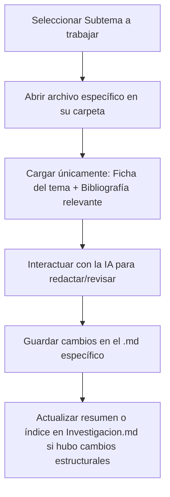

# Agentes de IA y Protocolo MCP para Evaluación Continua y Autoevaluación en Materias de Ingeniería en Informática

> **Proyecto de Iniciación a la Investigación – Convocatoria DASS UCSE 2025**  
> **Departamento Académico San Salvador | Universidad Católica de Santiago del Estero**  
> **Gabinete de Investigación en Informática y Tecnología (GIyT)**

---

## Ficha Técnica del Proyecto

| Campo | Detalle |
| :--- | :--- |
| **Título del Proyecto** | Agentes de IA y Protocolo MCP para evaluación continua y autoevaluación en materias de Ingeniería en Informática |
| **Director del Proyecto** | Ing. Fabio Argañaraz (Dedicación: 15 hs/sem) |
| **Asesora Metodológica** | Ing. Gabriela Bejarano (Dedicación: 6 hs/sem) |
| **Equipo de Estudiantes** | Samara Zamar, Mariano Sumbaino, Gino Grosso |
| **Período de Ejecución** | Noviembre 2025 – Octubre 2026 (Avance a Julio 2026: 50%) |
| **Cátedras de Aplicación** | **UCSE-DASS:**<br>• *Algoritmos y Programación* (1° año – Ingeniería en Informática)<br>• *Programación II* (3° año – Ingeniería en Informática)<br>• *Informática* (1° año – Tecnicatura Univ. en Automatización y Robótica)<br>**Universidad Nacional de Jujuy (UNJu):**<br>• *Sistemas Operativos II*<br>• *Teoría de los Sistemas Operativos* |
| **Marco Normativo** | RM 1557/2021 (Estándares de Ing. Informática), CONFEDI Libro Rojo (Enfoque por Competencias), Directrices UNESCO 2023, Código de Ética ACM 2018 |

---

## 1. Estructura General y Mapa de Navegación Modular

Para maximizar la calidad del trabajo asistido por IA y mantener el rigor académico sin sobrecargar el contexto de procesamiento, el proyecto se organiza en **módulos independientes y especializados**. Cada carpeta contiene sus propios documentos `.md` y fuentes de datos primarias:

```text
📁 Agentes de IA y Protocolo MCP.../
├── 📄 Investigacion.md (Documento Maestro / Orquestador)
├── 📄 AGENTS.md (Reglas operativas, rol del asistente y directrices éticas)
├── 📄 MEMORY.md (Memoria persistente, decisiones tomadas y roadmap)
├── 📁 01_problema_y_justificacion/
│   ├── 📄 01_planteo_problema.md
│   └── 📄 02_justificacion_curricular.md
├── 📁 02_estado_del_arte/
│   ├── 📄 01_ia_generativa_en_educacion_superior.md
│   └── 📄 02_protocolo_mcp_y_sistemas_multiagente.md
├── 📁 03_marco_teorico/
│   ├── 📄 01_evaluacion_formativa_black_wiliam.md
│   ├── 📄 02_aprendizaje_autorregulado_nicol.md
│   ├── 📄 03_arquitectura_agentes_mcp_educacion.md
│   └── 📄 04_marcos_eticos_unesco_acm.md
├── 📁 04_objetivos/
│   ├── 📄 01_objetivos_e_hipotesis.md
│   └── 📄 02_matriz_de_consistencia.md
├── 📁 05_metodologia/
│   ├── 📄 01_diseno_investigacion_accion.md
│   ├── 📄 02_contexto_y_muestra.md
│   ├── 📄 03_instrumentos_de_medicion.md
│   └── 📄 04_protocolos_eticos_y_consentimiento.md
├── 📁 06_desarrollo_tecnologico_toolkit/
│   ├── 📄 01_arquitectura_toolkit_mcp.md
│   ├── 📄 02_evaluadores_y_generadores.md
│   └── 📄 03_integracion_github_classroom_actions.md
├── 📁 07_pilotaje_y_resultados/
│   ├── 📄 01_pilotaje_primer_semestre.md
│   ├── 📄 02_analisis_cuantitativo_ritmo.md
│   ├── 📄 03_analisis_cualitativo_percepcion.md
│   └── 📄 04_incidentes_y_soluciones.md
├── 📁 08_transferencia_y_capacitacion/
│   ├── 📄 01_propuesta_taller_docente.md
│   ├── 📄 02_guias_operativas_y_skills.md
│   └── 📄 03_estrategia_escalamiento.md
├── 📁 09_conclusiones_y_prospectiva/
│   ├── 📄 01_conclusiones_preliminares.md
│   └── 📄 02_lineas_futuras_y_publicaciones.md
├── 📁 10_bibliografia/
│   ├── 📄 01_referencias_apa7.md
│   ├── 📄 02_fichas_de_lectura.md
│   └── 📁 fuentes_primarias/ (libros, papers y normativas PDF)
└── 📁 11_anexos/
    ├── 📄 01_rubricas_evaluacion.md
    ├── 📄 02_flujos_github_actions.md
    └── 📄 03_instrumentos_recoleccion.md
```

---

## 2. Índice Detallado con Enlaces Directos

### Gobernanza y Memoria Operativa del Proyecto
- [AGENTS.md](file:///c:/Universidad/Agentes%20de%20IA%20y%20Protocolo%20MCP%20para%20evaluaci%C3%B3n%20continua%20y%20autoevaluaci%C3%B3n%20en%20materias%20de%20Ingenier%C3%ADa%20en%20Inform%C3%A1tica%20-%202025/AGENTS.md): Directrices operativas, rol del asistente como investigador senior, reglas anti-alucinación de citas y protocolo de inyección de contexto.
- [MEMORY.md](file:///c:/Universidad/Agentes%20de%20IA%20y%20Protocolo%20MCP%20para%20evaluaci%C3%B3n%20continua%20y%20autoevaluaci%C3%B3n%20en%20materias%20de%20Ingenier%C3%ADa%20en%20Inform%C3%A1tica%20-%202025/MEMORY.md): Memoria persistente del proyecto entre sesiones, hito semestral (50% de avance), registro de decisiones técnicas y roadmap del 2do semestre.
- [SDD_Planificacion_Investigacion.md](file:///c:/Universidad/Agentes%20de%20IA%20y%20Protocolo%20MCP%20para%20evaluaci%C3%B3n%20continua%20y%20autoevaluaci%C3%B3n%20en%20materias%20de%20Ingenier%C3%ADa%20en%20Inform%C3%A1tica%20-%202025/SDD_Planificacion_Investigacion.md): Documento SDD (Spec-Driven Development) que planifica la transferencia del modelo de evaluación continua (skills y andamiaje) al proyecto de investigación.

### [Módulo 01: Planteo y Justificación del Problema](file:///c:/Universidad/Agentes%20de%20IA%20y%20Protocolo%20MCP%20para%20evaluaci%C3%B3n%20continua%20y%20autoevaluaci%C3%B3n%20en%20materias%20de%20Ingenier%C3%ADa%20en%20Inform%C3%A1tica%20-%202025/01_problema_y_justificacion/)
- [01_planteo_problema.md](file:///c:/Universidad/Agentes%20de%20IA%20y%20Protocolo%20MCP%20para%20evaluaci%C3%B3n%20continua%20y%20autoevaluaci%C3%B3n%20en%20materias%20de%20Ingenier%C3%ADa%20en%20Inform%C3%A1tica%20-%202025/01_problema_y_justificacion/01_planteo_problema.md): Identificación de las tres brechas críticas en la enseñanza de programación: retroalimentación tardía/heterogénea, escasa evaluación del proceso frente al producto, y limitaciones para la autoevaluación formativa continua.
- [02_justificacion_curricular.md](file:///c:/Universidad/Agentes%20de%20IA%20y%20Protocolo%20MCP%20para%20evaluaci%C3%B3n%20continua%20y%20autoevaluaci%C3%B3n%20en%20materias%20de%20Ingenier%C3%ADa%20en%20Inform%C3%A1tica%20-%202025/01_problema_y_justificacion/02_justificacion_curricular.md): Vinculación con los estándares CONFEDI (Libro Rojo de segunda generación), Resolución Ministerial 1557/2021 y el régimen de evaluación continua de UCSE-DASS.

### [Módulo 02: Estado del Arte y Antecedentes](file:///c:/Universidad/Agentes%20de%20IA%20y%20Protocolo%20MCP%20para%20evaluaci%C3%B3n%20continua%20y%20autoevaluaci%C3%B3n%20en%20materias%20de%20Ingenier%C3%ADa%20en%20Inform%C3%A1tica%20-%202025/02_estado_del_arte/)
- [01_ia_generativa_en_educacion_superior.md](file:///c:/Universidad/Agentes%20de%20IA%20y%20Protocolo%20MCP%20para%20evaluaci%C3%B3n%20continua%20y%20autoevaluaci%C3%B3n%20en%20materias%20de%20Ingenier%C3%ADa%20en%20Inform%C3%A1tica%20-%202025/02_estado_del_arte/01_ia_generativa_en_educacion_superior.md): Revisión sistemática sobre autograding, Large Language Models (LLMs) como asistentes de código (Copilot, ChatGPT) e impacto en productividad y aprendizaje en ciencias de la computación.
- [02_protocolo_mcp_y_sistemas_multiagente.md](file:///c:/Universidad/Agentes%20de%20IA%20y%20Protocolo%20MCP%20para%20evaluaci%C3%B3n%20continua%20y%20autoevaluaci%C3%B3n%20en%20materias%20de%20Ingenier%C3%ADa%20en%20Inform%C3%A1tica%20-%202025/02_estado_del_arte/02_protocolo_mcp_y_sistemas_multiagente.md): Surgimiento del Model Context Protocol (MCP) como estándar abierto para la orquestación segura y modular de agentes de IA con herramientas del entorno académico.

### [Módulo 03: Marco Teórico](file:///c:/Universidad/Agentes%20de%20IA%20y%20Protocolo%20MCP%20para%20evaluaci%C3%B3n%20continua%20y%20autoevaluaci%C3%B3n%20en%20materias%20de%20Ingenier%C3%ADa%20en%20Inform%C3%A1tica%20-%202025/03_marco_teorico/)
- [01_evaluacion_formativa_black_wiliam.md](file:///c:/Universidad/Agentes%20de%20IA%20y%20Protocolo%20MCP%20para%20evaluaci%C3%B3n%20continua%20y%20autoevaluaci%C3%B3n%20en%20materias%20de%20Ingenier%C3%ADa%20en%20Inform%C3%A1tica%20-%202025/03_marco_teorico/01_evaluacion_formativa_black_wiliam.md): Modelo "Inside the Black Box" de Black & Wiliam (1998): evaluación formativa, clarificación de metas y retroalimentación interactiva.
- [02_aprendizaje_autorregulado_nicol.md](file:///c:/Universidad/Agentes%20de%20IA%20y%20Protocolo%20MCP%20para%20evaluaci%C3%B3n%20continua%20y%20autoevaluaci%C3%B3n%20en%20materias%20de%20Ingenier%C3%ADa%20en%20Inform%C3%A1tica%20-%202025/03_marco_teorico/02_aprendizaje_autorregulado_nicol.md): Los 7 principios de buena retroalimentación de Nicol & Macfarlane-Dick (2006) y el desarrollo de la autorregulación metacognitiva en entornos de programación.
- [03_arquitectura_agentes_mcp_educacion.md](file:///c:/Universidad/Agentes%20de%20IA%20y%20Protocolo%20MCP%20para%20evaluaci%C3%B3n%20continua%20y%20autoevaluaci%C3%B3n%20en%20materias%20de%20Ingenier%C3%ADa%20en%20Inform%C3%A1tica%20-%202025/03_marco_teorico/03_arquitectura_agentes_mcp_educacion.md): Conceptualización del agente MCP como andamiaje cognitivo mediador que preserva la soberanía del juicio docente.
- [04_marcos_eticos_unesco_acm.md](file:///c:/Universidad/Agentes%20de%20IA%20y%20Protocolo%20MCP%20para%20evaluaci%C3%B3n%20continua%20y%20autoevaluaci%C3%B3n%20en%20materias%20de%20Ingenier%C3%ADa%20en%20Inform%C3%A1tica%20-%202025/03_marco_teorico/04_marcos_eticos_unesco_acm.md): Principios éticos: transparencia, mitigación de sesgos algorítmicos, privacidad de datos de estudiantes y código de ética ACM / UNESCO (2023).

### [Módulo 04: Objetivos e Hipótesis](file:///c:/Universidad/Agentes%20de%20IA%20y%20Protocolo%20MCP%20para%20evaluaci%C3%B3n%20continua%20y%20autoevaluaci%C3%B3n%20en%20materias%20de%20Ingenier%C3%ADa%20en%20Inform%C3%A1tica%20-%202025/04_objetivos/)
- [01_objetivos_e_hipotesis.md](file:///c:/Universidad/Agentes%20de%20IA%20y%20Protocolo%20MCP%20para%20evaluaci%C3%B3n%20continua%20y%20autoevaluaci%C3%B3n%20en%20materias%20de%20Ingenier%C3%ADa%20en%20Inform%C3%A1tica%20-%202025/04_objetivos/01_objetivos_e_hipotesis.md): Objetivo general y desagregación en objetivos específicos (OE1 al OE4), hipótesis de trabajo y metas cuantitativas.
- [02_matriz_de_consistencia.md](file:///c:/Universidad/Agentes%20de%20IA%20y%20Protocolo%20MCP%20para%20evaluaci%C3%B3n%20continua%20y%20autoevaluaci%C3%B3n%20en%20materias%20de%20Ingenier%C3%ADa%20en%20Inform%C3%A1tica%20-%202025/04_objetivos/02_matriz_de_consistencia.md): Alineación metodológica cruzada: Problema ⇄ Pregunta ⇄ Objetivo ⇄ Variable/Dimensión ⇄ Indicador ⇄ Instrumento de medición.

### [Módulo 05: Estrategia Metodológica](file:///c:/Universidad/Agentes%20de%20IA%20y%20Protocolo%20MCP%20para%20evaluaci%C3%B3n%20continua%20y%20autoevaluaci%C3%B3n%20en%20materias%20de%20Ingenier%C3%ADa%20en%20Inform%C3%A1tica%20-%202025/05_metodologia/)
- [01_diseno_investigacion_accion.md](file:///c:/Universidad/Agentes%20de%20IA%20y%20Protocolo%20MCP%20para%20evaluaci%C3%B3n%20continua%20y%20autoevaluaci%C3%B3n%20en%20materias%20de%20Ingenier%C3%ADa%20en%20Inform%C3%A1tica%20-%202025/05_metodologia/01_diseno_investigacion_accion.md): Enfoque de Investigación-Acción Educativa con métodos mixtos (Cualitativo-Cuantitativo) en cuatro fases iterativas.
- [02_contexto_y_muestra.md](file:///c:/Universidad/Agentes%20de%20IA%20y%20Protocolo%20MCP%20para%20evaluaci%C3%B3n%20continua%20y%20autoevaluaci%C3%B3n%20en%20materias%20de%20Ingenier%C3%ADa%20en%20Inform%C3%A1tica%20-%202025/05_metodologia/02_contexto_y_muestra.md): Población, muestra no probabilística intencional y caracterización de comisiones regulares y recursantes en UCSE-DASS.
- [03_instrumentos_de_medicion.md](file:///c:/Universidad/Agentes%20de%20IA%20y%20Protocolo%20MCP%20para%20evaluaci%C3%B3n%20continua%20y%20autoevaluaci%C3%B3n%20en%20materias%20de%20Ingenier%C3%ADa%20en%20Inform%C3%A1tica%20-%202025/05_metodologia/03_instrumentos_de_medicion.md): Definición operacional: Sistema de Puntos de Ritmo, planillas de seguimiento de entregas, rúbricas de Pull Requests y encuestas de percepción.
- [04_protocolos_eticos_y_consentimiento.md](file:///c:/Universidad/Agentes%20de%20IA%20y%20Protocolo%20MCP%20para%20evaluaci%C3%B3n%20continua%20y%20autoevaluaci%C3%B3n%20en%20materias%20de%20Ingenier%C3%ADa%20en%20Inform%C3%A1tica%20-%202025/05_metodologia/04_protocolos_eticos_y_consentimiento.md): Consentimiento informado estudiantil, anonimización de telemetría y transparencia algorítmica en devoluciones.

### [Módulo 06: Desarrollo Tecnológico del Toolkit](file:///c:/Universidad/Agentes%20de%20IA%20y%20Protocolo%20MCP%20para%20evaluaci%C3%B3n%20continua%20y%20autoevaluaci%C3%B3n%20en%20materias%20de%20Ingenier%C3%ADa%20en%20Inform%C3%A1tica%20-%202025/06_desarrollo_tecnologico_toolkit/)
- [01_arquitectura_toolkit_mcp.md](file:///c:/Universidad/Agentes%20de%20IA%20y%20Protocolo%20MCP%20para%20evaluaci%C3%B3n%20continua%20y%20autoevaluaci%C3%B3n%20en%20materias%20de%20Ingenier%C3%ADa%20en%20Inform%C3%A1tica%20-%202025/06_desarrollo_tecnologico_toolkit/01_arquitectura_toolkit_mcp.md): Arquitectura de software: integración de Model Context Protocol con clientes IA (Claude/Antigravity IDE) y servidores de validación local y remota.
- [02_evaluadores_y_generadores.md](file:///c:/Universidad/Agentes%20de%20IA%20y%20Protocolo%20MCP%20para%20evaluaci%C3%B3n%20continua%20y%20autoevaluaci%C3%B3n%20en%20materias%20de%20Ingenier%C3%ADa%20en%20Inform%C3%A1tica%20-%202025/06_desarrollo_tecnologico_toolkit/02_evaluadores_y_generadores.md): Especificación técnica del evaluador HTML+CSS, andamiaje estructural (`Configuration-Files`), generador de exámenes de React y ecosistema de skills de C++ (`ayp-examenes-sdd`, `ayp-clases-quizizz`).
- [03_integracion_github_classroom_actions.md](file:///c:/Universidad/Agentes%20de%20IA%20y%20Protocolo%20MCP%20para%20evaluaci%C3%B3n%20continua%20y%20autoevaluaci%C3%B3n%20en%20materias%20de%20Ingenier%C3%ADa%20en%20Inform%C3%A1tica%20-%202025/06_desarrollo_tecnologico_toolkit/03_integracion_github_classroom_actions.md): Orquestación inicial con GitHub Classroom, cuotas de Actions, disparadores idempotentes (`setup-issues.yml`) y pivote arquitectónico hacia ClassMoji (LMS nativo de Git con tokens y emojis).

### [Módulo 07: Pilotaje y Resultados Empíricos](file:///c:/Universidad/Agentes%20de%20IA%20y%20Protocolo%20MCP%20para%20evaluaci%C3%B3n%20continua%20y%20autoevaluaci%C3%B3n%20en%20materias%20de%20Ingenier%C3%ADa%20en%20Inform%C3%A1tica%20-%202025/07_pilotaje_y_resultados/)
- [01_pilotaje_primer_semestre.md](file:///c:/Universidad/Agentes%20de%20IA%20y%20Protocolo%20MCP%20para%20evaluaci%C3%B3n%20continua%20y%20autoevaluaci%C3%B3n%20en%20materias%20de%20Ingenier%C3%ADa%20en%20Inform%C3%A1tica%20-%202025/07_pilotaje_y_resultados/01_pilotaje_primer_semestre.md): Crónica del despliegue en Programación II y Algoritmos y Programación (Marzo – Junio 2026).
- [02_analisis_cuantitativo_ritmo.md](file:///c:/Universidad/Agentes%20de%20IA%20y%20Protocolo%20MCP%20para%20evaluaci%C3%B3n%20continua%20y%20autoevaluaci%C3%B3n%20en%20materias%20de%20Ingenier%C3%ADa%20en%20Inform%C3%A1tica%20-%202025/07_pilotaje_y_resultados/02_analisis_cuantitativo_ritmo.md): Indicadores de regularidad en entregas, curva de aprendizaje en commits y métricas extraídas de la planilla de Puntos de Ritmo.
- [03_analisis_cualitativo_percepcion.md](file:///c:/Universidad/Agentes%20de%20IA%20y%20Protocolo%20MCP%20para%20evaluaci%C3%B3n%20continua%20y%20autoevaluaci%C3%B3n%20en%20materias%20de%20Ingenier%C3%ADa%20en%20Inform%C3%A1tica%20-%202025/07_pilotaje_y_resultados/03_analisis_cualitativo_percepcion.md): Valoración estudiantil sobre la inmediatez del feedback y vivencia de la cátedra en la revisión cualitativa de Pull Requests.
- [04_incidentes_y_soluciones.md](file:///c:/Universidad/Agentes%20de%20IA%20y%20Protocolo%20MCP%20para%20evaluaci%C3%B3n%20continua%20y%20autoevaluaci%C3%B3n%20en%20materias%20de%20Ingenier%C3%ADa%20en%20Inform%C3%A1tica%20-%202025/07_pilotaje_y_resultados/04_incidentes_y_soluciones.md): Lecciones aprendidas e incidentes críticos: cuotas de GitHub Actions, issues formativas, integración de alumnos recursantes y migración de contingencia ante el cierre de GitHub Classroom.

### [Módulo 08: Transferencia Institucional y Capacitación](file:///c:/Universidad/Agentes%20de%20IA%20y%20Protocolo%20MCP%20para%20evaluaci%C3%B3n%20continua%20y%20autoevaluaci%C3%B3n%20en%20materias%20de%20Ingenier%C3%ADa%20en%20Inform%C3%A1tica%20-%202025/08_transferencia_y_capacitacion/)
- [01_propuesta_taller_docente.md](file:///c:/Universidad/Agentes%20de%20IA%20y%20Protocolo%20MCP%20para%20evaluaci%C3%B3n%20continua%20y%20autoevaluaci%C3%B3n%20en%20materias%20de%20Ingenier%C3%ADa%20en%20Inform%C3%A1tica%20-%202025/08_transferencia_y_capacitacion/01_propuesta_taller_docente.md): Propuesta formal del Taller Interno (Agosto 2026, 10 hs) para capacitar en MCP, CI/CD y despliegue en ClassMoji.
- [02_guias_operativas_y_skills.md](file:///c:/Universidad/Agentes%20de%20IA%20y%20Protocolo%20MCP%20para%20evaluaci%C3%B3n%20continua%20y%20autoevaluaci%C3%B3n%20en%20materias%20de%20Ingenier%C3%ADa%20en%20Inform%C3%A1tica%20-%202025/08_transferencia_y_capacitacion/02_guias_operativas_y_skills.md): Sistematización del andamiaje universal (`Configuration-Files`), guías de frontend/backend y paquete de skills de IA reutilizables.
- [03_estrategia_escalamiento.md](file:///c:/Universidad/Agentes%20de%20IA%20y%20Protocolo%20MCP%20para%20evaluaci%C3%B3n%20continua%20y%20autoevaluaci%C3%B3n%20en%20materias%20de%20Ingenier%C3%ADa%20en%20Inform%C3%A1tica%20-%202025/08_transferencia_y_capacitacion/03_estrategia_escalamiento.md): Hoja de ruta para extender el modelo a otras asignaturas de ingeniería y carreras del Departamento Académico San Salvador.

### [Módulo 09: Conclusiones y Prospectiva](file:///c:/Universidad/Agentes%20de%20IA%20y%20Protocolo%20MCP%20para%20evaluaci%C3%B3n%20continua%20y%20autoevaluaci%C3%B3n%20en%20materias%20de%20Ingenier%C3%ADa%20en%20Inform%C3%A1tica%20-%202025/09_conclusiones_y_prospectiva/)
- [01_conclusiones_preliminares.md](file:///c:/Universidad/Agentes%20de%20IA%20y%20Protocolo%20MCP%20para%20evaluaci%C3%B3n%20continua%20y%20autoevaluaci%C3%B3n%20en%20materias%20de%20Ingenier%C3%ADa%20en%20Inform%C3%A1tica%20-%202025/09_conclusiones_y_prospectiva/01_conclusiones_preliminares.md): Balance general al 50% de ejecución: viabilidad técnica del protocolo MCP y efectividad pedagógica observada.
- [02_lineas_futuras_y_publicaciones.md](file:///c:/Universidad/Agentes%20de%20IA%20y%20Protocolo%20MCP%20para%20evaluaci%C3%B3n%20continua%20y%20autoevaluaci%C3%B3n%20en%20materias%20de%20Ingenier%C3%ADa%20en%20Inform%C3%A1tica%20-%202025/09_conclusiones_y_prospectiva/02_lineas_futuras_y_publicaciones.md): Plan de redacción del informe final, preparación de papers para congresos (WICC / CACIC / JAIIO) y extensión hacia agentes tutores.

### [Módulo 10: Bibliografía y Fuentes](file:///c:/Universidad/Agentes%20de%20IA%20y%20Protocolo%20MCP%20para%20evaluaci%C3%B3n%20continua%20y%20autoevaluaci%C3%B3n%20en%20materias%20de%20Ingenier%C3%ADa%20en%20Inform%C3%A1tica%20-%202025/10_bibliografia/)
- [01_referencias_apa7.md](file:///c:/Universidad/Agentes%20de%20IA%20y%20Protocolo%20MCP%20para%20evaluaci%C3%B3n%20continua%20y%20autoevaluaci%C3%B3n%20en%20materias%20de%20Ingenier%C3%ADa%20en%20Inform%C3%A1tica%20-%202025/10_bibliografia/01_referencias_apa7.md): Repositorio formal de citas según normas APA 7ma edición con enlaces web y metadatos completos.
- [02_fichas_de_lectura.md](file:///c:/Universidad/Agentes%20de%20IA%20y%20Protocolo%20MCP%20para%20evaluaci%C3%B3n%20continua%20y%20autoevaluaci%C3%B3n%20en%20materias%20de%20Ingenier%C3%ADa%20en%20Inform%C3%A1tica%20-%202025/10_bibliografia/02_fichas_de_lectura.md): Síntesis analíticas, citas textuales y extracción de conceptos clave de la literatura primaria para referencia rápida del modelo de IA.
- [📁 fuentes_primarias/](file:///c:/Universidad/Agentes%20de%20IA%20y%20Protocolo%20MCP%20para%20evaluaci%C3%B3n%20continua%20y%20autoevaluaci%C3%B3n%20en%20materias%20de%20Ingenier%C3%ADa%20en%20Inform%C3%A1tica%20-%202025/10_bibliografia/fuentes_primarias/): Ubicación designada para almacenar libros en formato PDF/EPUB, artículos científicos y normativas oficiales.

### [Módulo 11: Anexos y Documentación Operativa](file:///c:/Universidad/Agentes%20de%20IA%20y%20Protocolo%20MCP%20para%20evaluaci%C3%B3n%20continua%20y%20autoevaluaci%C3%B3n%20en%20materias%20de%20Ingenier%C3%ADa%20en%20Inform%C3%A1tica%20-%202025/11_anexos/)
- [01_rubricas_evaluacion.md](file:///c:/Universidad/Agentes%20de%20IA%20y%20Protocolo%20MCP%20para%20evaluaci%C3%B3n%20continua%20y%20autoevaluaci%C3%B3n%20en%20materias%20de%20Ingenier%C3%ADa%20en%20Inform%C3%A1tica%20-%202025/11_anexos/01_rubricas_evaluacion.md): Tablas de rúbricas analíticas para Frontend, Backend y Algoritmos en C++.
- [02_flujos_github_actions.md](file:///c:/Universidad/Agentes%20de%20IA%20y%20Protocolo%20MCP%20para%20evaluaci%C3%B3n%20continua%20y%20autoevaluaci%C3%B3n%20en%20materias%20de%20Ingenier%C3%ADa%20en%20Inform%C3%A1tica%20-%202025/11_anexos/02_flujos_github_actions.md): Archivos de configuración YAML (`setup-issues.yml`, `classroom.yml`, workflows de feedback).
- [03_instrumentos_recoleccion.md](file:///c:/Universidad/Agentes%20de%20IA%20y%20Protocolo%20MCP%20para%20evaluaci%C3%B3n%20continua%20y%20autoevaluaci%C3%B3n%20en%20materias%20de%20Ingenier%C3%ADa%20en%20Inform%C3%A1tica%20-%202025/11_anexos/03_instrumentos_recoleccion.md): Modelos de consentimiento informado, cuestionarios Likert y esquemas de planillas Excel.

---

## 3. Síntesis Ejecutiva del Estado de la Investigación (Hito 50%)

### 3.1 Grado de Avance de Objetivos Específicos
Al cierre de la primera mitad del cronograma (Noviembre 2025 – Junio 2026), el proyecto presenta un **avance ponderado del 50%**:

| Objetivo Específico | Estado | % Avance | Logros Principales | Desafíos y Ajustes Resueltos |
| :--- | :---: | :---: | :--- | :--- |
| **OE1: Diseñar arquitectura del sistema con agentes y MCP** | En curso | **60%** | Implementación del Evaluador HTML+CSS y Generador de Exámenes React con MCP. | La envergadura de la automatización requirió mayor dedicación técnica de la proyectada. |
| **OE2: Integrar el sistema en las cátedras seleccionadas** | Cumplido / En curso | **100% / 50%** | Despliegue en *Programación II* mediante GitHub Classroom y guías operativas. En *Algoritmos y Programación* se integró a partir de las actividades del segundo examen y simulacros. | Transición a plantillas públicas para sortear límites de cuota de GitHub Actions. |
| **OE3: Evaluar la efectividad mediante análisis descriptivo y temático** | Iniciado | **20%** | Instrumentación del "Sistema de Puntos de Ritmo" en planilla Excel para medir continuidad y constancia. | La consolidación estadística definitiva se ejecutará al cierre del segundo semestre. |
| **OE4: Documentar resultados y proponer mejoras futuras** | En curso | **50%** | Redacción de guías arquitectónicas, registro de incidentes y propuesta formal del taller docente para agosto 2026. | Se documentó la fricción inicial de recursantes con soluciones de acompañamiento. |

---

## 4. Guía de Trabajo Asistido por IA (Workflow Modular)

Para redactar, expandir o corregir cualquiera de las secciones utilizando un asistente de IA (como Gemini o Claude), se recomienda seguir este protocolo de **inyección de contexto mínimo suficiente**:



### Reglas de Oro para la Interacción con la IA:
1. **Evitar alimentar todo el proyecto a la vez:** Trabajar archivo por archivo. Cuando redactes el marco teórico de evaluación formativa, adjunta únicamente `03_marco_teorico/01_evaluacion_formativa_black_wiliam.md` y la ficha correspondiente de `10_bibliografia/02_fichas_de_lectura.md`.
2. **Mantener la trazabilidad de citas:** Toda afirmación teórica o empírica generada por la IA debe contrastarse inmediatamente con la referencia en `10_bibliografia/01_referencias_apa7.md`.
3. **Validación humana docente:** Las decisiones pedagógicas y los criterios de evaluación generados deben ser revisados por el Director o Asesora Metodológica antes de considerarse definitivos.
